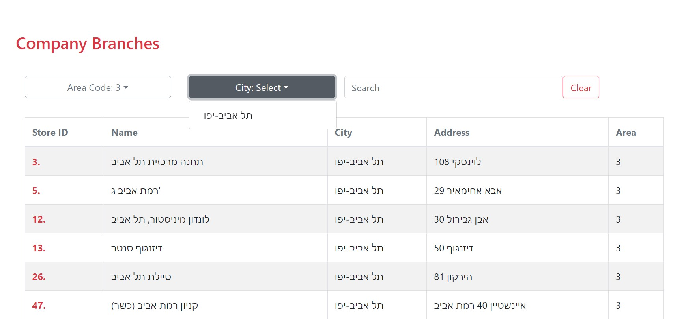

Basic web screen designed with React Framework, Redux and Redux-thunk middleware  
CSS: SCSS and react-bootstrap are in use to create responsive web screen  
Server: Simple node server to allow access from client
###

Demo:

###
Setup:
1. Install Client Node-modules      
Run cd client && npm install
Run cd ../server && npm install
2. Run NPM Start  
run npm install on the root folder  
run npm start  
Note: concurrently is used to run server and client in parallel  
Alternatively, you can open 2 seperates terminals on client and server and run npm start on each terminal.
   ###
   You Are Done!! Open localhst:3000 in your browser.  
###
###
Author: Sara Greenblatt
